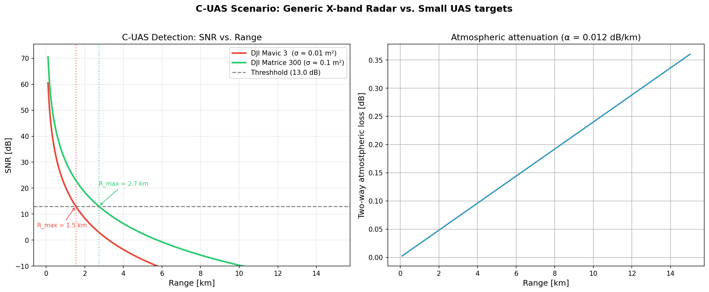
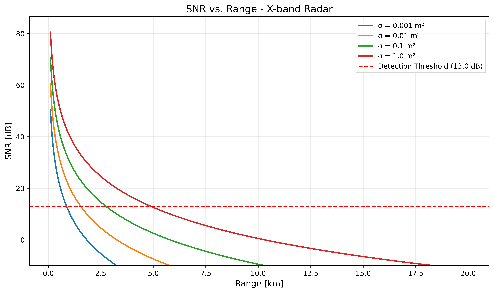

# radar-fundamentals
Radar range equation tool with C-UAS scenario analysis

# The Physics
The radar range equation is used to determine the capabilities of a single radar depending on the radar system's parameters, given a particular target of a particular cross section with respect to the radar's parameters at a particular range in a particular environment. 

The radar's parameters are set by its power, the size and/or gain of its antenna, the noise from its internal electronics, the bandwidth of its transmitted signal, and its total system losses which can include transmit loss, receive loss, signal processing loss, etc..

The cross section of any given target can depend on its physical size, material, viewing angle, position fluctuation, the wavelength of the incident signal, and more.

Finally, the environmental factors can also depend on wavelength due to different atmospheric attenuation effects (water vapor or oxygen absorption), weather, clutter, jamming, incidental electromagnetic interference and more.

```
         Pt * G^2 * lambda^2 * sigma
SNR = ------------------------------------
       (4*pi)^3 * R^4 * k * Tsys * Bn * L
```


The extent to which each of these factors affect a radar signal are vast and can be expanded upon in detail that is far outside the scope of this simple program. The key insight for this calculation is the dominance of range dependency for every calculation. The signal propagates out from the radar in 3D space requiring a signal loss that is dominated by a R^2 term. After target reflection, the signal again travels back to the radar requiring another loss of R^2. The total propagation loss being dependent on a R^4 term outweighs all other considerations in this calculation.

# Why it Matters for C-UAS
This calculation is specifically focused on the radar detection scenario of two popular drones - the DJI Mavic 3 and the Matrice 300 in the X-band range, a scenario becoming more commonplace and necessary with the proliferation of drone warfare. Each drone has a different radar cross-section and this significantly affects the range at which they can be first detected and defensive strategies can be deployed. The Mavic 3 has a cross-section similar to the size of a pigeon, indicating that other factors should be taken into account for true classification in order to have stronger detection.

# The Atmospheric Model
The atmospheric attenuation model (ITU-R P.676) included in this calculation is a simplified model and while it is sufficient here, calculations at other frequencies, ranges and environments would require different treatments.

# How to Run this Program
```bash
git clone https://github.com/cnseacrist/radar-fundamentals.git
cd radar-fundamentals
python3 -m venv venv
source venv/bin/activate
pip install -r requirements.txt
python3 radar_range_equation.py
```

# Sample Output
Here is the example output:
``` 
=======================================================
RADAR RANGE EQUATION TOOL
=======================================================
  Peak Power:       1000 W  (30.0 dBW)
  Antenna Gain:     30.0 dBi
  Frequency:        10.0 GHz
  Wavelength:       3.00 cm
  Noise Figure:     4.0 dB
  Noise Bandwidth:  1.0 MHz
  System Losses:    6.0 dB
  Detection Thresh: 13.0 dB
  Atm Attenuation:  0.012 dB/km (one-way)
=======================================================

    RCS [m²]          Free-space         With atm.      Range lost
------------------------------------------------------------------
       0.001            0.87 km            0.87 km             1 m
       0.010            1.54 km            1.54 km             4 m
       0.100            2.74 km            2.73 km            10 m
       1.000            4.88 km            4.85 km            32 m

Atmospheric Loss at Key Ranges (alpha=0.012 dB/km):
       Range    Two-way loss
  ----------  --------------
         1 km        0.024 dB
         2 km        0.048 dB
         5 km        0.120 dB
        10 km        0.240 dB
        20 km        0.480 dB

Generating Plot...
  Saved: snr_vs_range.png

=======================================================
C-UAS SCENARIO ANALYSIS
=======================================================
    DJI Mavic 3 (σ ≈ 0.01 m²): R_max = 1.54 km
    DJI Matrice 300 (σ ≈ 0.1 m²): R_max = 2.73 km
 Saved: cuas_scenario.png
```

# Generated Plots
With two PNG files outputted 





# Future Work
Future work can include calculating the detection range for these drones while including terms in the radar range equation for pulse integration, clutter, doppler processing and more.

# References
 - Principles of Modern Radar: Basic Principles by Richards, Scheer and Holmes
 - Introduction to Radar Systems by Skolnik
 - Introduction to Radar Lecture Series by Lincoln Labs
 - ITU-R P.676

# About
My name is Charles Seacrist and I am a prior naval officer with a masters degree in physics. I am an amateur engineer, drone hobbyist and radar researcher.
